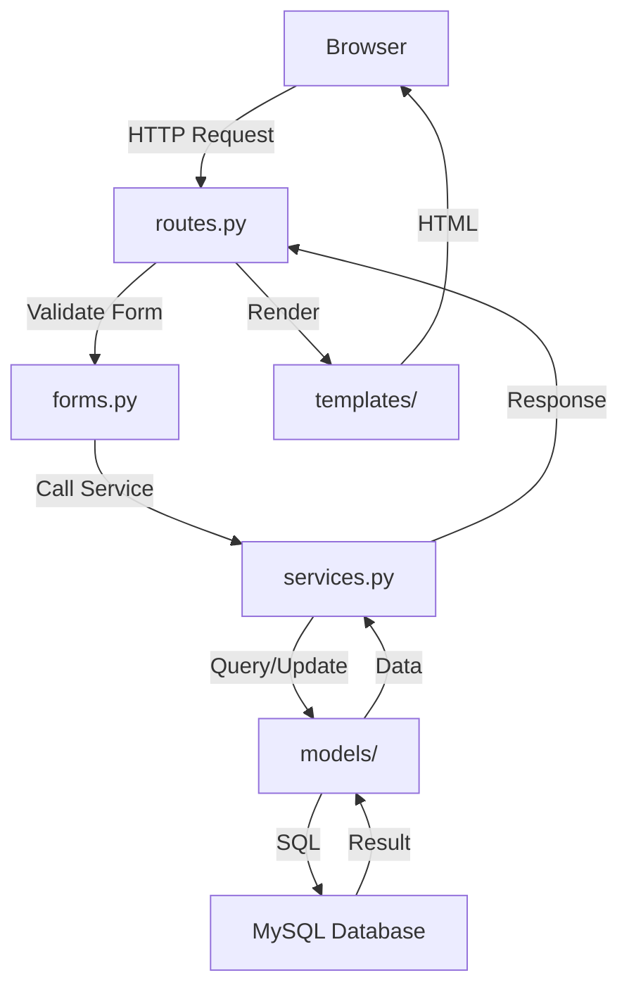

## Directory Overview

The project follows a **modular architecture** organized by domain and responsibility:

```
muebles-roble-diseno-app/
├── app/                          # Main application package
│   ├── __init__.py               # Flask app factory
│   ├── extensions.py             # Flask extensions (SQLAlchemy, CSRF, Migrate)
│   ├── exceptions.py             # Custom exceptions and error handlers
│   │
│   ├── catalogs/                 # Catalog modules
│   │   ├── colors/               # Color management
│   │   │   ├── __init__.py       # Blueprint registration
│   │   │   ├── routes.py         # Routes and controllers
│   │   │   ├── services.py       # Business logic
│   │   │   └── forms.py          # WTForms forms
│   │   ├── wood_types/           # Wood types management
│   │   ├── furniture_type/       # Furniture types
│   │   ├── roles/                # User roles
│   │   └── unit_of_measures/     # Measurement units
│   │
│   ├── models/                   # Database models (ORM)
│   │   ├── __init__.py
│   │   ├── color.py
│   │   ├── wood_type.py
│   │   ├── furniture_type.py
│   │   ├── role.py
│   │   └── unit_of_measure.py
│   │
│   └── templates/                # Jinja2 HTML templates
│       ├── base.html             # Base layout
│       ├── colors/               # Color templates
│       │   ├── list.html
│       │   ├── create.html
│       │   └── edit.html
│       ├── errors/               # Error pages
│       ├── furniture_types/
│       ├── roles/
│       ├── unit_of_measures/
│       └── wood_types/
│
├── migrations/                   # Database migrations (Alembic)
│   └── versions/
│
├── docs/                         # Project documentation
│   ├── ARCHITECTURE.md
│   └── CODING_CONVENTIONS.md
│
├── config.py                     # Application configuration
├── run.py                        # Application entry point
├── requirements.txt              # Python dependencies
├── .env                          # Environment variables (not versioned)
├── .env-template                 # Environment template
└── README.md
```

## Architectural Layers

The application follows a **layered MVC architecture** with clear separation of concerns:

```
┌─────────────────────────────────────────────────────────────┐
│                    PRESENTATION LAYER                       │
│               (routes.py + Jinja2 templates)                │
│          Routes / Controllers / HTML Views                  │
├─────────────────────────────────────────────────────────────┤
│                  BUSINESS LOGIC LAYER                       │
│                      (services.py)                          │
│     Business Rules / Validations / Processing               │
├─────────────────────────────────────────────────────────────┤
│                    DATA/MODEL LAYER                         │
│                       (models/)                             │
│          Entities / ORM SQLAlchemy / Database               │
└─────────────────────────────────────────────────────────────┘
```

<CardGroup cols={3}>
  <Card title="Presentation" icon="window">
    **routes.py** + **templates/**
    
    Handles HTTP requests, renders views, manages form submission
  </Card>
  <Card title="Business Logic" icon="gears">
    **services.py**
    
    Contains domain logic, validations, and orchestrates operations
  </Card>
  <Card title="Data Layer" icon="database">
    **models/**
    
    Defines entities and database mappings using SQLAlchemy ORM
  </Card>
</CardGroup>

## Layer Responsibilities

| Layer              | Files                           | Responsibility                                                    |
|--------------------|-------------------------------- |-------------------------------------------------------------------|
| **Presentation**   | `routes.py` + `templates/`      | Define routes, receive HTTP requests, render HTML with Jinja2    |
| **Services**       | `services.py`                   | Business logic, validations, operation orchestration              |
| **Models**         | `models/*.py`                   | Define entities and map to database tables via SQLAlchemy ORM     |
| **Configuration**  | `config.py`, `extensions.py`    | Environment config, database connection, Flask extensions         |

## Module Organization

### Domain Module Structure

Each domain module (e.g., `colors`, `wood_types`) follows a consistent structure:

```python
catalogs/
└── colors/
    ├── __init__.py      # Blueprint and exports
    ├── routes.py        # Routes and controllers
    ├── services.py      # Business logic
    └── forms.py         # WTForms forms
```

### Example: Colors Module

<Steps>
  <Step title="Blueprint Registration">
    `__init__.py` creates and exports the Flask Blueprint:
    
    ```python app/catalogs/colors/__init__.py
    from flask import Blueprint

    colors_bp = Blueprint('colors', __name__)

    from . import routes  # noqa: E402, F401
    ```
  </Step>
  
  <Step title="Routes Definition">
    `routes.py` defines HTTP endpoints:
    
    ```python app/catalogs/colors/routes.py
    from . import colors_bp
    from .forms import ColorForm
    from .services import ColorService

    @colors_bp.route('/create', methods=['GET', 'POST'])
    def create_color():
        # Handle form and call service
        pass
    ```
  </Step>
  
  <Step title="Business Logic">
    `services.py` contains domain logic:
    
    ```python app/catalogs/colors/services.py
    class ColorService:
        @staticmethod
        def create(data: dict) -> dict:
            # Validation and business rules
            # Database operations
            pass
    ```
  </Step>
  
  <Step title="Form Validation">
    `forms.py` defines WTForms:
    
    ```python app/catalogs/colors/forms.py
    from flask_wtf import FlaskForm
    from wtforms.validators import DataRequired

    class ColorForm(FlaskForm):
        name = StringField('Nombre', validators=[DataRequired()])
    ```
  </Step>
</Steps>

## Request Flow

Understanding how a request flows through the application:



<Steps>
  <Step title="Request Received">
    Browser sends HTTP request to Flask route in `routes.py`
  </Step>
  <Step title="Form Processing">
    Route validates submitted form using WTForms
  </Step>
  <Step title="Business Logic">
    Route calls service method with validated data
  </Step>
  <Step title="Database Operation">
    Service uses models to query/update database via SQLAlchemy
  </Step>
  <Step title="Response Rendering">
    Route renders Jinja2 template with data and returns HTML
  </Step>
</Steps>

## Core Components

### Application Factory

The `create_app()` function in `app/__init__.py` creates and configures the Flask application:

```python app/__init__.py
def create_app():
    app = Flask(__name__)
    
    # Load configuration
    app.config.from_object(Config)
    
    # Initialize extensions
    db.init_app(app)
    migrate.init_app(app, db)
    csrf.init_app(app)
    
    # Register error handlers
    register_error_handlers(app)
    
    # Register blueprints
    from .catalogs.colors import colors_bp
    app.register_blueprint(colors_bp, url_prefix='/colors')
    
    return app
```

### Extensions

Flask extensions are initialized in `app/extensions.py`:

```python app/extensions.py
from flask_sqlalchemy import SQLAlchemy
from flask_migrate import Migrate
from flask_wtf.csrf import CSRFProtect

db = SQLAlchemy()          # Database ORM
migrate = Migrate()        # Database migrations
csrf = CSRFProtect()       # CSRF protection
```

### Configuration

Application configuration in `config.py`:

```python config.py
class Config:
    # Database configuration
    DB_USER = os.getenv("DB_USER")
    DB_PASSWORD = os.getenv("DB_PASSWORD")
    DB_HOST = os.getenv("DB_HOST")
    DB_PORT = os.getenv("DB_PORT")
    DB_NAME = os.getenv("DB_NAME")
    
    SQLALCHEMY_DATABASE_URI = (
        f"mysql+pymysql://{DB_USER}:{DB_PASSWORD}@{DB_HOST}:{DB_PORT}/{DB_NAME}"
    )
    
    # Security
    SECRET_KEY = os.getenv("SECRET_KEY")
    SQLALCHEMY_TRACK_MODIFICATIONS = False
```

## Database Models

Models define the database schema using SQLAlchemy ORM. Example from `app/models/color.py`:

```python app/models/color.py
class Color(db.Model):
    __tablename__ = 'colors'
    
    id_color = db.Column(db.Integer, primary_key=True)
    name = db.Column(db.String(50), nullable=False, unique=True)
    active = db.Column(db.Boolean, nullable=False, default=True)
    
    created_at = db.Column(db.TIMESTAMP, server_default=func.current_timestamp())
    updated_at = db.Column(db.TIMESTAMP, server_onupdate=func.current_timestamp())
    deleted_at = db.Column(db.TIMESTAMP, nullable=True)
    
    def to_dict(self) -> dict:
        return {
            "id_color": self.id_color,
            "name": self.name,
            "active": self.active
        }
```

## Template Organization

Templates are organized by module with a shared base template:

- `base.html` - Shared layout with navigation and flash messages
- `{module}/list.html` - List/index view
- `{module}/create.html` - Create form
- `{module}/edit.html` - Edit form
- `errors/error.html` - Generic error page

## Next Steps

<CardGroup cols={2}>
  <Card title="Coding Conventions" icon="code" href="/development/coding-conventions">
    Learn the project's coding standards
  </Card>
  <Card title="Templates Guide" icon="file-code" href="/development/templates">
    Work with Jinja2 templates
  </Card>
  <Card title="Forms Guide" icon="input-text" href="/development/forms">
    Create and validate forms
  </Card>
  <Card title="Deployment" icon="rocket" href="/development/deployment">
    Deploy to production
  </Card>
</CardGroup>
